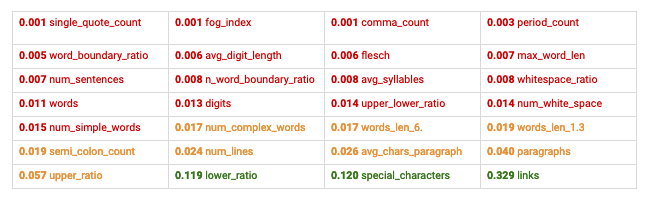
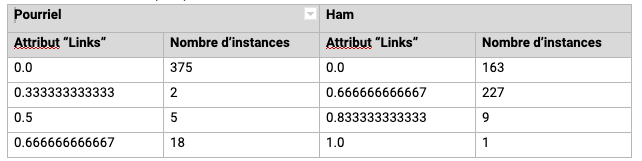
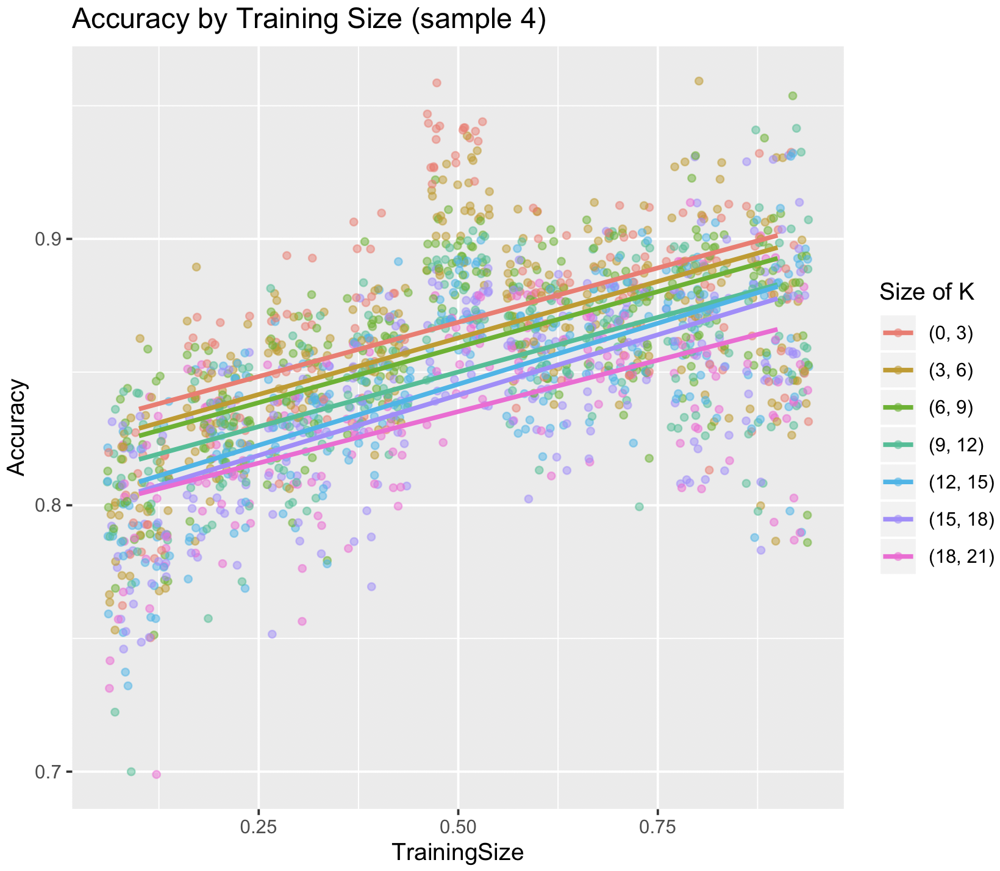

# Spam Detection

## Introduction

Nous avons décidé d’étudier la détection des courriels pourriels; c’est-à-dire,  la classification binaire de courriels permettant de distinguer si les courriels sont des pourriels ou non. Un courriel pourriel est souvent envoyé par les publicitaires [1]. Aussi les courriels indésirables peuvent même être envoyés par une personne qui a l’intention de voler les informations de l’utilisateur [2].

La détection des pourriels est un sujet important, car il y a plus d’un million de personnes qui envoient des courriels pour communiquer dans leurs vies quotidiennes personnelles et au travail. Chaque jour, il y a des utilisateurs qui sont affectés par la transmission de pourriels. 

## Description du jeu de données

Nos données ont été téléchargées de Kaggle (https://www.kaggle.com/veleon/ham-and-spam-dataset) où il y avait deux dossiers. Le premier dossier avait 501 courriels pourriels tandis que l’autre dossier 2551 courriels non-pourriels. Donc, nous avons manuellement séparé et choisi nos données d'entraînement ou de données test parmi tous les courriels téléchargés. Puisque nos données étaient des courriels, il n’y avait que de mots. Donc, aucune colonne. 

Nos courriels étaient sous format de HTML. Donc nous avions nettoyé les données en enlevant les en- têtes de HTML comme <html>...</html>, <head>...</head>, etc.. Par la suite, nous avons aussi enlevé les mots les plus fréquents qui apparaissaient dans chacun des courriels et nous avons fait du stemming sur chaque mot. 

Pour ce projet, nous avons décidé d’analyser les données en 3 différents cas. Le premier cas était de regarder à un ensemble d'entraînement balancé. Nous avons choisi 400 pourriels et 400 non-pourriels. Le deuxième cas était d’analyser un ensemble d'entraînement déséquilibré qui est le suréchantillonnage de pourriels. Nous avons choisi 460 pourriels et 100 courriels non-pourriels. Le dernier cas était d’analyser un ensemble d'entraînement déséquilibré qui est le sous-échantillonnage de pourriels. Nous avons pris 400 courriels pourriels et 2500 courriels non-pourriels.

Nous avons pris 80 courriels pour données dans l’ensemble de test. Cet ensemble test est le même pour les 3 cas décrits ci-dessus. Nous voulions analyser quel cas va nous retourner les meilleurs résultats avec ces 80 courriels. Note: les courriels dans l’ensemble test ont été choisis au hasard. Aucun courriel n’est dans l’ensemble d'entraînement. 

## Naïve Bayes

Le premier algorithme de classification choisi était Naïve Bayes qui est un modèle probabiliste. Nous l’avons choisi, car il peut classifier les courriels basé sur les mots des courriels dans l’ensemble d'entraînement. Naive Bayes est un classifieur qui utilise le théorème de Bayes. L’implémentation a été programmée en Java sans package. En d’autres mots, nous avons recodé Naive Bayes en nous inspirant des notes de cours.

Voici le nom de chaque méthode ainsi qu’une description:

- calculateProbability: calcul les probabilités conditionnelles en tenant compte s’il y a du lissage ou non. S’il y a du lissage, on multiplie la probabilité conditionnelle par le paramètre de lissage.
- getPriors: calcul le priori pour la classe passée en paramètre
- classifierNB: prend en argument si le classifieur utilise le lissage. La méthode va à travers de chaque courriel dans l’ensemble test. La variable probSpam appelle la méthode calculateProbability qui retourne le posteriori que le courriel est un pourriel, puis la variable appelle la même méthode calculateProbability qui retourne le posteriori que le courriel est non-pourriel. La méthode calculateProbability reçoit en paramètre une chaîne de caractère qui indique si on veut calculer la probabilité d’un pourriel ou d’un non-pourriel. Par la suite, multiple les proabilités à prioris et on classifie le courriel qui avait la plus grande probabilité. Si les deux variables ont la même probabilité, on suppose que le courriel est un pourriel.
- exportCSV: la méthode prend en paramètre un chemin qui est l’endroit qu’on a sauvegardé le csv vide et aussi un ArrayList qui sont les résultats qu’on veut afficher dans le csv. 

> Note: le main du Naive Bayes est dans le fichier Naive_Bayes_main.java

Détails de la mise-en-oeuvre:
1. appeler la méthode classifierNB
2. aller à travers de chaque courriel de l’ensemble test
3. pour chaque courriel de l’ensemble test
    
    1. appeler la méthode calculateProbability en passant en paramètre la chaîne de caractère “spam” qui retourne le posteriori d’un pourriel
    1. appeler la méthode getPriors en passant en paramètre la chaîne de caractère “spam” qui retourne le priori d’un pourriel
    1. multiplier le priori et le posteriori pour déterminer la probabilité que le courriel soit un pourriel
    1. appeler la méthode calculateProbability en passant en paramètre la chaîne de caractère “ham” qui retourne le posteriori d’un courriel non-pourriel
    1. appeler la méthode getPriors en passant en paramètre la chaîne de caractère “ham” qui retourne le priori d’un courriel non-pourriel
    1. multiplier le priori et le posteriori pour déterminer la probabilité que le courriel ne soit pas un pourriel
    1. prendre la plus grande probabilité entre les résultats obtenus aux étapes (c) et (g) et classifier le courriel. Si la probabilité est la même, classifier le courriel en tant que pourriel.

Pour ce projet, nous avons voulu comparer les différents paramètres de lissage. Nous avons choisi les paramètres de lissage suivants: 

- 0 (aucun lissage)
- 0,1(la plupart des exemples utilisent un paramètre de lissage de 0,1)
- 1 (un paramètre de lissage qui n’est pas une décimale)

Tableau 1: Précision pour les trois cas

Paramètre de lissage | Classes balancées | Classes déséquilibrées (suréchantillonnage de pourriels) | Classes déséquilibrées (sous-échantillonnage de pourriels)
--- | --- | --- | ---
0 | 50% | 50% | 50%
0,1 | 83,75% | 50% |63,75%
1 | 80% | 48,75% |56,25%

Le tableau ci-dessus représente la précision pour les 3 cas balancés et déséquilibrés avec le suréchantillonnage et sous-échantillonnage de pourriels. Lorsque nous avons mis le paramètre de lissage à 0, toutes les probabilités étaient zéro. Dans notre cas, il y avait au moins un token dans chaque courriel de l’ensemble test qui n’existait pas dans un des courriels de  l’ensemble d'entraînement. Donc, puisqu’une probabilité conditionnelle était à 0, la probabilité que le courriel soit un pourriel ou un non-pourriel est 0. Nous avons supposé que si la probabilité qu’un courriel soit un pourriel est équivalente à la probabilité que le courriel soit un non-pourriel, alors on le classifie comme un pourriel. Le 50% veut dire qu’il y a 50% des courriels qui ont bien été classifiés.

Par la suite, en regardant les précisions de chaque classe, nous pouvons voir que les résultats sont beaucoup mieux que les classes balancées. Nous déduisons que la raison pour laquelle l’ensemble d'entraînement balancé nous retourne les meilleurs résultats est à cause des prioris. Par exemple: si nous n’avons pas assez de données pour la classe pourriel, lorsque nous multiplions le posteriori avec le priori, le classifieur naïf bayésien va probablement classifier le courriel en tant que non-pourriel. En d’autres mots, le plus que l’ensemble d'entraînement est déséquilibré, le plus grand écart qu’il y aura entre les prioris pourriel et non-pourriel qui affectera la probabilité du courriel test.

## k-NN

Pour cet algorithme, nous avons uniquement utilisé les données du cas 1 qui était l’ensemble d'entraînement balancé pour tenir compte des exigences temporelles du projet.

L’algorithme de k-Nearest Neighbors (kNN, k-NN) est un algorithme de classification binaire du style “lazy-learning”. Pour chaque courriel dans l’ensemble test, l'algorithme calcul la distance entre le courriel test et tous les courriels dans l’ensemble d'entraînement. Par la suite, on choisi les k distances les plus petites et on prend l’étiquette le plus représentée parmi eux. L’étiquette est ensuite utilisée pour classifier l’élément.

L’algorithme kNN nécessite des nombres réels pour exécuter en utilisant une distance cartésienne. Par contre, le format des courriels est en mot. Donc, nous avons eu besoin de changer les représentations de ces courriels pour pouvoir exécuter l’algorithme kNN et en tirer des conclusions. Nous avons suivi deux stratégies pour accomplir cette tâche :

1. La première stratégie était d’aller à travers de chaque courriel dans l’ensemble test. Pour chaque courriel non classifié, on utilisait tous ses mots et on les comparait aux mots des courriels dans l’ensemble d'entraînement à classifier afin de calculer les distances.

2. La deuxième stratégie était d’extraire des attributs de tous les courriels pour utiliser ces attributs pour faire la classification.


Ces deux stratégies ont été explorées davantage dans les sections qui suivent. 

### Approche 1 : Calculer la distance entre chaque courriel

1. Le calcule de la distance entre les mots d’un courriel et la collection de chaque mot dans l’ensemble d'entraînement prenait énormément de temps. Il y avait 55,000+ colonnes (attributs) dans le fichier de données et une itération de test prenait plus de vingt minutes.
2. La précision des résultats était très variable (entre 50% et 85%). Vu que nous voulions augmenter la précision, la manipulation des données de test était nécessaire. Ceci implique la création d'un nouveau fichier CSV contenant plus de 55,000 attributs (mots) pour enlever ou modifier la liste des termes, une tâche très dispendieuse.

Pour ces raisons une nouvelle manière rapide de créer des fichiers qui pouvaient accommoder l’algorithme de kNN était nécessaire.

### Approche 2 : Exploration d’attributs

L’approche d’extraction d’attributs a eu beaucoup plus de succès avec des précisions aux alentours de 87% et maximales de 96%. Pour se faire, l’extraction d’attributs a eu lieu uniquement sur le corps des courriels (nous aurions pu extraire des attributs des en-têtes de courriels. Par contre, l’exploration du corps et les augmentations du taux de précision d’itération à itération nous ont gardés captivés. Les en-têtes n’ont pas été explorés. Nous soupçonnons que ceux-ci augmenteront d’avantages la précision de notre système.). Voici la liste d’attributs qui ont été extraits :

A|B|C|D
---|---|---|---
single_quote_count|fog_index|comma_count|period_count
word_boundary_ratio|avg_digit_length|flesch|max_word_len
num_sentences|n_word_boundary_ratio|avg_syllables|whitespace_ratio
words|digits|upper_lower_ratio|num_white_space
num_simple_words|num_complex_words|words_len_6.|words_len_1.3
semi_colon_count|num_lines|avg_chars_paragraph|paragraphs
upper_ratio|lower_ratio|special_characters|links

L’extraction des attributs ainsi que l’exécution de l’algorithme ne reposent pas sur l’utilisation de librairies externes. Les attributs ont été extraits en utilisant des expressions régulières. Voir le fichier email.py. Les étapes du processus d’analyse pour kNN étaient :

1. Analyser les courriels de manière manuelle et explorer davantage les types d’informations qui étaient présents. (courriels Plain text)
1. Créer et tester les expressions régulières en se basant sur les articles de recherches [Al-Shboul et al, Kiwanuka et al.] (code Python).
1. Rouler le code Python pour obtenir des représentations des courriels en format nombre réel. (format CSV)
1. Normaliser les valeurs obtenues dans (3). (format CSV)
1. Exécuter l’algorithme k-NN (code Java).
1. Analyser les résultats (code R).

Les méthodes importantes dans le code du fichier KNN.java:

- distance: Calcule la distance entre deux courriels.
- getNeighbors: Obtiens la liste des k courriel avec les plus petites distances.
- predict: obtient la classe pour un courriel non classifié.

Les méthodes importantes dans le code du fichier email.py:

- find_features: Exécuter la compilation des attributs pour chaque courriel.
- normalize: Normalisation des valeurs dans chaque colonne pour avoir des valeurs 0-1.0.

#### Résultats de l’approche 2

Les résultats initiaux ont été utilisés pour calculer les coefficients de détermination. L’objectif était de voir l’impact d’un attribut sur les résultats d’une classification. Voici liste d’attributs qui ont été extraits la ainsi que leurs coefficients de détermination R2.

Il semblerait que les trois attributs ayant une grande influence sur la classification des courriels sont le ratio de caractère en lettre minuscule vs en lettre majuscule, les nombres de caractères spéciaux, ainsi que le montant de liens dans un courriel. La segmentation de ces attributs basée sur la valeur de leurs R2 a été complétée avec les prochaines précisions :

1. Hamspam_green.csv : Contient le data brute avec les attributs verts. (précision moyenne ~82.5%)
1. Hamspam_orange-green.csv : Contient le data brute avec les attributs vert et orange. (précision moyenne ~85.6%)
1. Hamspam_red-orange-green.csv : Contient le data brute avec tous les attributs. (précision moyenne ~87%)
1. Hamspam_red.csv : Contient le data brute avec les attributs rouges. (précision moyenne de 73%)

Voici l’extrait des statistiques pour l’attribut links:

Ce tableau semble indiquer que les courriels de type “spam” sont plus souvent classifiés comme n’ayant aucun lien. Ceci est contre notre intuition vu qu’il est difficile d’inviter les personnes à acheter un produit (tel qu’est le cas dans plusieurs courriels pourriel) sans lien. Ceci nous mène à croire que l’expression régulière pour l’extraction du nombre de liens est fautive. Par contre, elle est fautive tout en gardant un aspect d’individualité propre à chaque classe. Donc, pour des fins de classification, elle atteint son objectif.

Voici une visualisation des résultats avec des différentes valeurs de K et du nombre total de courriel en mémoire :

Figure 1: Résultats des testes de précision. Une valeur k = {1,2,3} semble être plus précise pour des valeurs de TrainingSize (courriels en mémoire pendant la classification, max = 0.9) plus près de 1.

## Conclusion

Pour conclure, nous avons fait le traitement de données en Java. Nous avons aussi re-codé les méthodes Naive Bayes et kNN sans utiliser de packages. L’ensemble d'entraînement balancé pour l'algorithme Naive Bayes nous a retourné une meilleur précision que les classes déséquilibrés. Du côté kNN, nous avons appris que même si il y a des erreurs dans l’extraction d’attribut et que l’extraction se fait mal, mais uniformément mal, qu’il peut quand-même être utilisé dans la classification et avoir un impact.

## Références

- Lien du code source sur GitHub: https://github.com/cedric-c/spam_classifier (sera publique après le 5 décembre)
- Dernier commit hash pour branche Master: 27987b620f436ec52648e2e5ae519fbecc7a7313
- Dernier commit hash pour branche knn: f97d4a97106bd5ba6dce7a3b20df21432ebc4caa
- Références dans le code: 
- https://www.geeksforgeeks.org/traverse-through-a-hashmap-in-java/
- https://raw.githubusercontent.com/caarmen/porter-stemmer/master/library/src/main/java/ca/rmen/porterstemmer/PorterStemmer.java
- https://www.geeksforgeeks.org/different-ways-reading-text-file-java/
- Données téléchargées de Kaggle: https://www.kaggle.com/veleon/ham-and-spam-dataset
- [1] - Wikipédia. (2019). Pourriel. Consulté le 1er décembre 2019. https://fr.wikipedia.org/wiki/Spam        
- [2] - Octopuce. (2019). Pourriels, piratage supposé, menaces – les faux mails malins du web. Consulté le 1er décembre 2019. https://www.octopuce.fr/spams-piratage-suppose-menaces-les-faux-mails-malins-du-web/
- [3] - Jaroli.H. (2019). K-Nearest Neighbors (KNN) with Python. Consulté le 11 novembre 2019. https://datascienceplus.com/k-nearest-neighbors-knn-with-python/
- [4] - Harrison.O. (2018). Machine Learning Basics with the K-Nearest Neighbors Algorithm. Consulté le 16 novembre 2019.   https://towardsdatascience.com/machine-learning-basics-with-the-k-nearest-neighbors-algorithm-6a6e71d01761
- [5] - Dua.S. (2018). Text Classification using K Nearest Neighbors. Consulté le 16 novembre 2019. https://towardsdatascience.com/text-classification-using-k-nearest-neighbors-46fa8a77acc5
- [6] - Al-Shboul, Bashar, Heba Hakh, Hossam Faris, Ibrahim Aljarah, & Hamad Alsawalqah. "Voting-based Classification for E-mail Spam Detection." Journal of ICT Research and Applications [en ligne], 10.1 (2016): 29-42. Web. Consulté le 3 décembre 2019
- [7] - Kiwanuka, Fred & Alqatawna, Ja’far & Amin, Anang & Paul, Sujni & Faris, Hossam. (2019). Towards Automated Comprehensive Feature Engineering for Spam Detection. 429-437. 10.5220/0007393004290437. Consulté le 3 décembre 2019

                         
